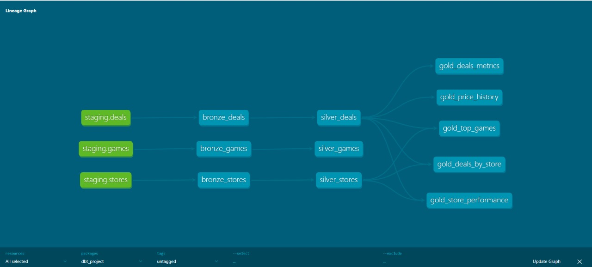

# Projeto de Data Lake com Arquitetura Medallion

Este projeto implementa uma solução moderna de data lake utilizando o padrão de arquitetura Medallion com Iceberg, dbt, Trino, Airflow, MinIO, Metabase e Docker.

## Visão Geral da Arquitetura

O projeto segue a arquitetura Medallion (Bronze, Silver, Gold) para processamento de dados:

- **Camada Bronze**: Ingestão de dados brutos dos sistemas de origem
- **Camada Silver**: Dados limpos, validados e transformados
- **Camada Gold**: Dados agregados prontos para análise de negócios

## Tecnologias

### Apache Iceberg
- Formato de tabela projetado para grandes conjuntos de dados analíticos
- Evolução de esquema e evolução de partição
- Capacidades de viagem no tempo e reversão
- Alto desempenho para processamento de grandes volumes de dados

### dbt (Data Build Tool)
- Transforma dados no data warehouse usando SQL
- Gerencia transformações de dados através das camadas medallion
- Fornece testes, documentação e linhagem




### Trino (anteriormente PrestoSQL)
- Motor de consulta SQL distribuído
- Conecta-se a várias fontes de dados
- Permite consultas analíticas rápidas em todo o data lake

### Apache Airflow
- Orquestra os fluxos de trabalho do pipeline de dados
- Agenda e monitora tarefas de processamento de dados
- Gerencia dependências entre tarefas


### MinIO
- Armazenamento de objetos compatível com S3
- Armazena dados brutos e processados
- Fornece armazenamento escalável de alto desempenho


### Metabase
- Business intelligence e análise
- Cria painéis e visualizações
- Permite análises self-service para usuários de negócios


### Docker
- Conteineriza todos os componentes
- Garante ambientes consistentes
- Simplifica implantação e escalabilidade

## Estrutura do Projeto

```
trino-datalake/
├── airflow/            # DAGs e configurações do Airflow
├── dbt/                # Modelos, testes e documentação do dbt
├── docker/             # Arquivos de configuração do Docker
├── images/             # Imagens para documentação
├── metabase/           # Configuração do Metabase
├── minio/              # Configuração do MinIO
└── trino/              # Configuração do Trino
```

## Como Começar

### Pré-requisitos
- Docker e Docker Compose
- Git

### Instalação

1. Clone o repositório:
```bash
git clone <url-do-repositório>
cd trino-datalake
```

2. Inicie os serviços:
```bash
docker-compose up -d
```

3. Acesse os serviços:
- Airflow: http://localhost:8080
- MinIO: http://localhost:9000
- Metabase: http://localhost:3000
- Trino: http://localhost:8989

## Fluxo de Dados

1. Dados brutos são ingeridos no MinIO (camada Bronze)
2. Airflow orquestra o pipeline de processamento
3. Trino lê dados do MinIO
4. dbt transforma dados através das camadas medallion
5. Dados transformados são armazenados de volta no MinIO como tabelas Iceberg
6. Metabase conecta-se ao Trino para análises e visualização

## Configuração

Detalhes de configuração para cada componente podem ser encontrados em seus respectivos diretórios.

## Contribuição

Contribuições são bem-vindas! Sinta-se à vontade para enviar um Pull Request.

## Licença

Este projeto está licenciado sob a Licença MIT - veja o arquivo LICENSE para detalhes. 